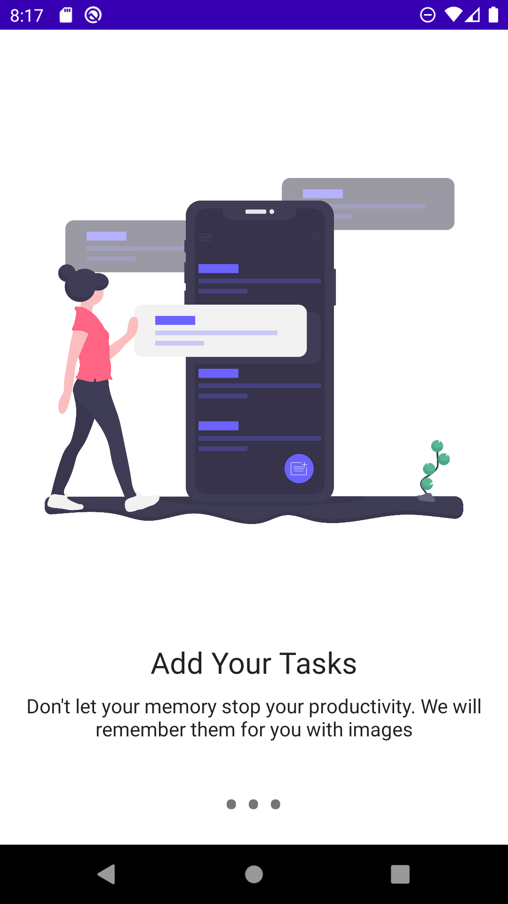
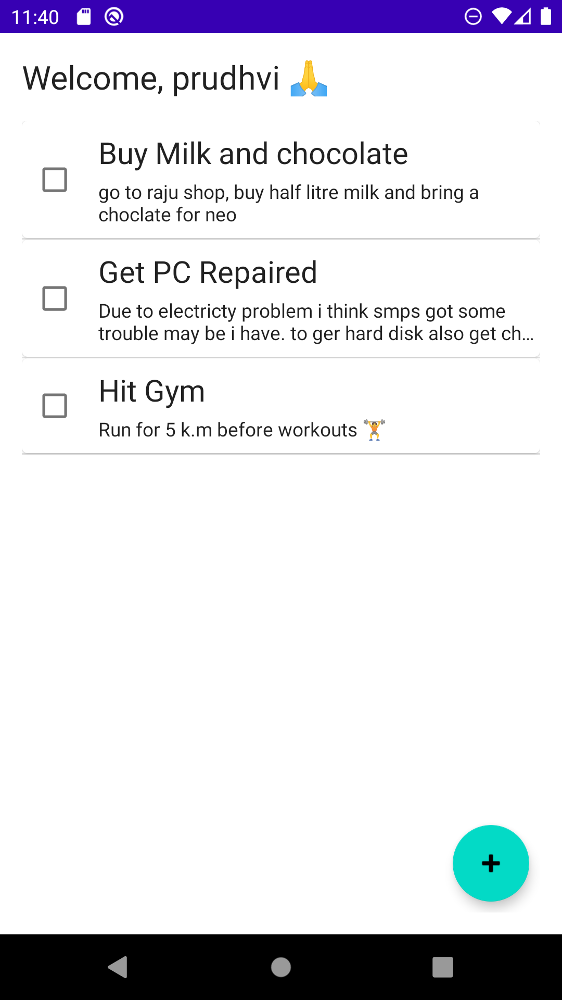
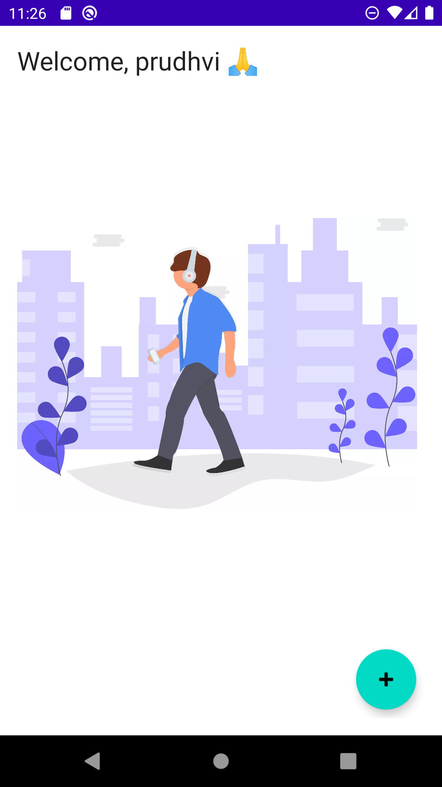
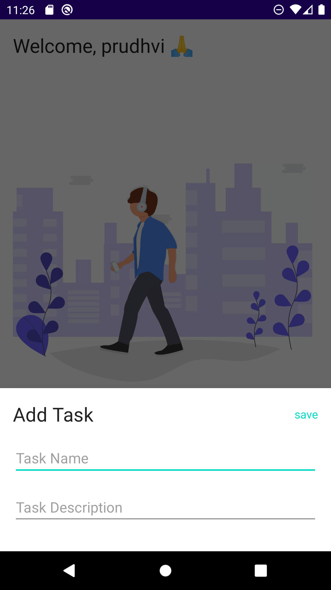
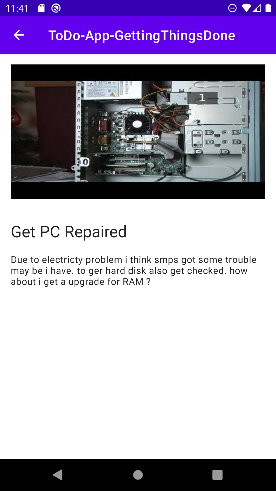

# ToDoApp
###### A pretty simple notes app covering modern android concepts

<table>
   <tr>
     <td><kbd></kbd></td>
     <td><kbd></kbd></td>
     <td><kbd></kbd></td>
     <tr> 
      <td><kbd></kbd></td>
     <td><kbd></kbd></td>
     <td><kbd></kbd></td>
    </tr>
     <tr> 
      <td><kbd></kbd></td>
     <td><kbd></kbd></td>
     <td><kbd></kbd></td>
</table>

### Features

* Be able to add tasks and with image support
* Automatically delete tasks which are completed for every 15 minutes
* Coming soon...

